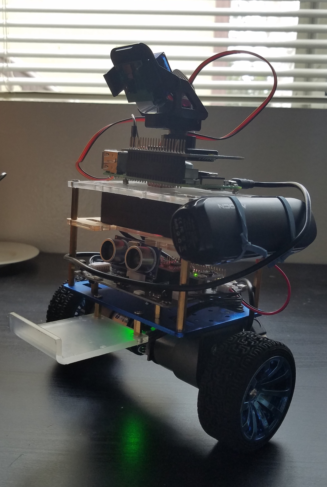

---
title: Final Report
layout: template
filename: io4finalreport
pageheader: page-header-finalreport
--- 

# Abstract
The project RD-1 is the revolutionary start of implementing modern AI into everyday life. RD-1 is a retrieval robot that takes in a command from the user like "find me a keyboard" and then processes and executes the command. The robot has self pathing and image recognition as well as a microphone and speakers to communicate its findings with the user. In this paper we will talk about the critical research and steps that went along with building RD-1 as well go into why we started with RD-1 in the first place.
# Introduction
The RD-1 started as a general robot that would provide simple assistance to common people. From this we narrowed the idea down to one specific task that would lead the way for future simple assistance tasks to follow. This simple task was for the robot to listen to a retrieval command and then search and find the object based on that command. For this to work we needed a few key things: a robot skeleton as well as a way for the robot to see, communicate, and move around.
## Self Balancing Robot
In order to create RD-1 we wanted to find a base robot to build off of that we can connect our sound and camera system to easily and efficiently.
After researching the different base robots that we could order and build quickly, we decided upon using ELEGOO Tumbller the self balancing robot
(https://www.amazon.com/ELEGOO-Tumbller-Self-Balancing-Compatible-Arduino/dp/B07QWJH77V). The two-wheel self-balancing vehicle has a simple structure, flexible movement, easy driving, and convenient carrying, meeting the needs of energy-saving and environmental protection. We chose this robot because it was compatible with Arduino and worked nicely for our robot's independent motion. We also saw a way that we could implement a Raspberry Pi which would be useful for our communication and computer vision.
## Computer Vision
For the vision of the robot we first looked into OpenCV as it is a great source for general object detection. However, we wanted the
robot's computer vision to be adaptable as we refined its detection and maybe even limited the objects that it detects. Because of this we 
ended up using Tensorflow Object Detection which is a more general machine learning algorithm that can be applied on images as arrays in order to detect the images. This worked better than OpenCV because OpenCV is a computer vision specific library. Because Tenserflow is a more general machine learning based model we can train the model and have it adapt more fluidly than if we were to use OpenCV. We then connected this algorithm to cameras that we added to RD-1 through our Respberry Pi
## Voice Recognition
For the voice recognition that the robot would have, we looked into many different already created algorithms such as siri, google Text to Speech,
DeepSpeech, and SpeechRecognition 3.8.1 . We ended up using a combination of gTTS(google Text to Speech) and SpeechRecognition 3.8.1 and connected the algorithm to a Bluetooth speaker with a built in Microphone and one extra USB Microphone through our Raspberry Pi.
## Pathing
Because we used Tenserflow Object Detection for our general object detection, when it came time to implement the pathing we further used Tenserflow
to calculate the distance between the robot to the objects that it detects. Then we made sure that RD-1 was able to move on its own and calculate
how far it has moved in order to give the robot the ability to move towards an object once it has found the correct one. We did further research on
more complex pathing such as avoiding objects with multi-path learning and pathfinding algorithms but were unable to implement that at this time. As a result,our robot currently needs a clear path towards the object that it is retrieving in order to succeed.
# Contributions
Some key contributions that we have made include: creating an efficient and accurate object detection system with Tensorflow Object Detection, 
combined voice recognition techniques to create a unique algorithm for RD-1, and created a combination of computer vision, voice recognition,
and movement that can be easily implemented into any common day robot.
Overall, we believe that RD-1 is the start in the right direction of common day use of Artificial Intelligence and, once made more efficient, can be
cheaply and easily made and expanded upon in order to make AI more accessible and applicable in our modern word.
# Technical Material 
## Hardware
We use all parts for the self-balancing robot from  ELEGOO, such as motors, plastic frames, screws, nuts, and wheels. In addition, we also purchased fundamental control boards such as  Arduino Uno, a sensor board, and a motor driver.
Hardware component for the self-balancing robot.

<figure align="center">
  
  <figcaption>Hardware component for the self-balancing robot.</figcaption>
</figure>

<figure align="center">
  
  <figcaption>The overview of the hardware for RD-1 such as all control boards, sensors,and motors.</figcaption>
</figure>

<figure align="center">
  
  <figcaption>The body of the final droid.</figcaption>
</figure>

# Milestones

# Conclusion 

# References
- We use the TensorFlow Object Detection API. [The guide](https://github.com/EdjeElectronics/TensorFlow-Object-Detection-on-the-Raspberry-Pi) supports instructions for how to set up TensorFlow’s Object Detection API on the Raspberry Pi.
- [Retraining TensorFlow Object Detection API](https://tensorflow-object-detection-api-tutorial.readthedocs.io/en/latest/training.html)
- The mechanical robot Parts for a [self-balance droid](https://www.elegoo.com/pages/arduino-kits-support-files) and Arduino boards.
- [Two-degree-of-freedom](https://www.waveshare.com/wiki/Pan-Tilt_HAT) for controlling the camera.
- [Raspberry Pi 4](https://www.raspberrypi.org/products/)
- [Arduino Nano](https://www.arduino.cc/en/pmwiki.php?n=Main/ArduinoBoardNano)
