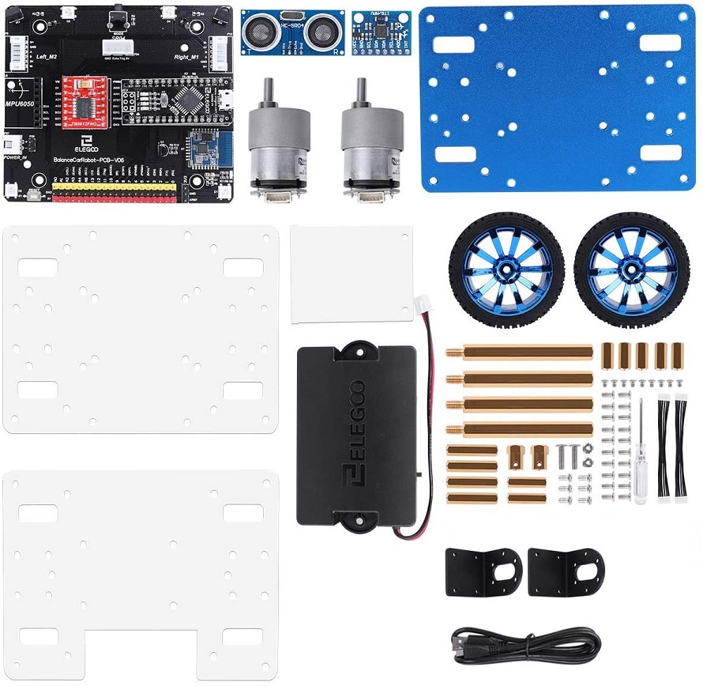
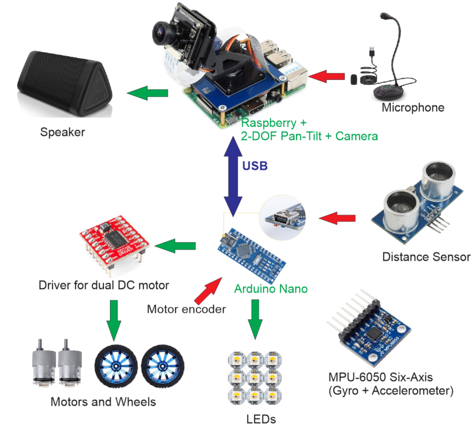
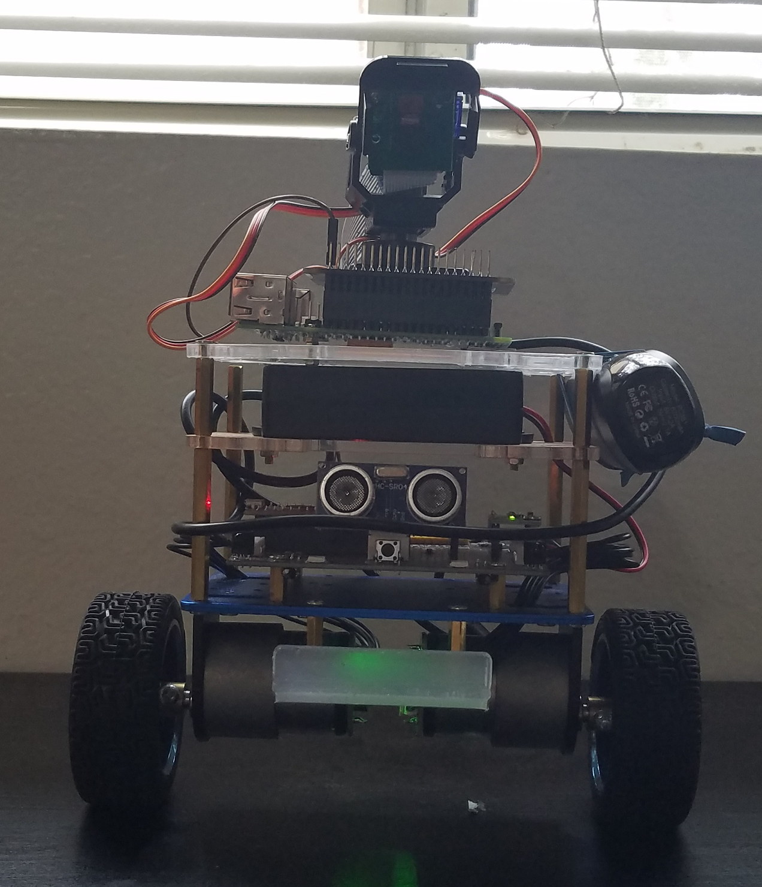

---
title: Final Report
layout: template
filename: io4finalreport
--- 
# Delete later
[Home](index.md)
[Presentations](io2presentation.md)
[Project Specification](io3projectspecification.md)
[Final report](io4finalreport.md)

# Abstract

# Introduction

# Technical Material 

Hardware component for the self-balancing robot.

     

The overview of the hardware for RD-1 such as all control boards, sensors,and motors.

     

The body of the final droid.

     

# Milestones

# Conclusion 

# References
- We use the TensorFlow Object Detection API. [The guide](https://github.com/EdjeElectronics/TensorFlow-Object-Detection-on-the-Raspberry-Pi) supports instructions for how to set up TensorFlow’s Object Detection API on the Raspberry Pi.
- The mechanical robot Parts for a [self-balance droid](https://www.elegoo.com/pages/arduino-kits-support-files) and Arduino boards.
- [Two-degree-of-freedom](https://www.waveshare.com/wiki/Pan-Tilt_HAT) for controlling the camera.
- [Raspberry Pi 4](https://www.raspberrypi.org/products/)